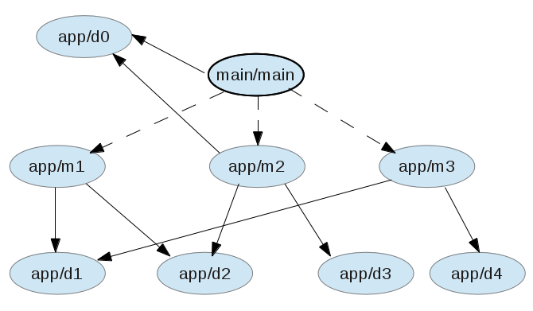

A simple example of Require-Lazy
================================

This example demonstrates as many use cases for Require-Lazy as possible with the least possible code.

The application displays several links. Clicking a link, lazy-loads the corresponding module and updates
a section of the HTML.

Setup
-----
It is assumed that Node.js is already installed.

1. Clone the GIT repository
1. Run `npm install` in this directory to install the express web framework
1. `cd build-scripts` and `node build.js` (the output goes to the build directory; minification is disabled for the example)
1. cd back to this directory and run `node app.js`
1. Hit http://localhost:8110/app.html (the development mode site) or http://localhost:8110/app-built.html (the built site-producton mode); click the links while keeping an eye on the "Net" tab in Firebug

What's going on?
================

Development view - app.html
---------------------------
Clicking each link lazy-loads the corresponding module and its dependencies. The modules simply write a message on the screen. The code for lazy-loading is not much different than using require directly:

	m1.get().done(function(m) {
		// here m is the real module
	});

In fact, the lazy.js plugin uses require.js behind the scenes in development mode to load modules.

The button labeled "Text" fetches a lazy text file using the text plugin, to demonstrate the cooperation of the two plugins:

	define([..., "lazy!text!app/m4.txt"], ...

and:

	m4.get().done(function(txt) {
		alert(txt);
	});

Production/Compiled view - app-built.html
-----------------------------------------
For the time being the two views (development and compiled) require different bootstrapping code. In the compiled view, script downloading is managed by Require-Lazy. Therefore it uses almond together with lazyloader that are much smaller than the full blown require.js script.

Take a look at the following dependencies diagram (this is not the actual diagram of this example application, rather a simplified one):

Each ellipse is a module. A solid line denotes dependency, a dashed line lazy dependency. So `main/main` depends on `app/d0` and lazily depends on `app/m1`. `app/d3` is used exclusively by `app/m2` and `app/d4` exclusively by `app/m3`. Dependencies that are exclusively used by a module, are bundled together with that module. The shared dependencies are bundled and downloaded separately. 

`app/d0` is shared by `main/main` and `app/m2`. According to the rule above, it should be bundled separately. However, since `main/main` is an ancestor of `app/m2` in the dependency tree, it will be bundled together with `main/main`, the parent.

Thus we can split the application in the following bundles:

- `main/main` and `app/d0` form the main bundled (named main-built.js)
- `app/m1` is bundled by itself (m1-built.js)
- `app/m2` and `app/d3` are bundled together (m2-built.js)
- `app/m3` and `app/d4` are bundled together (m3-built.js)
- `app/d1` is bundled by itself (given a name made by the md5 hash of its name, e.g. b968a4f466f444d503a3771396871d94.js)
- `app/d2` is bundled by itself (its name produce like `app/d1`)

The contents of each bundle are md5 hashed and the hash is appended to the URL as the `v` request parameter. This (together with the server sending correct caching headers) allows the browser to cache the files until their real contents change.
